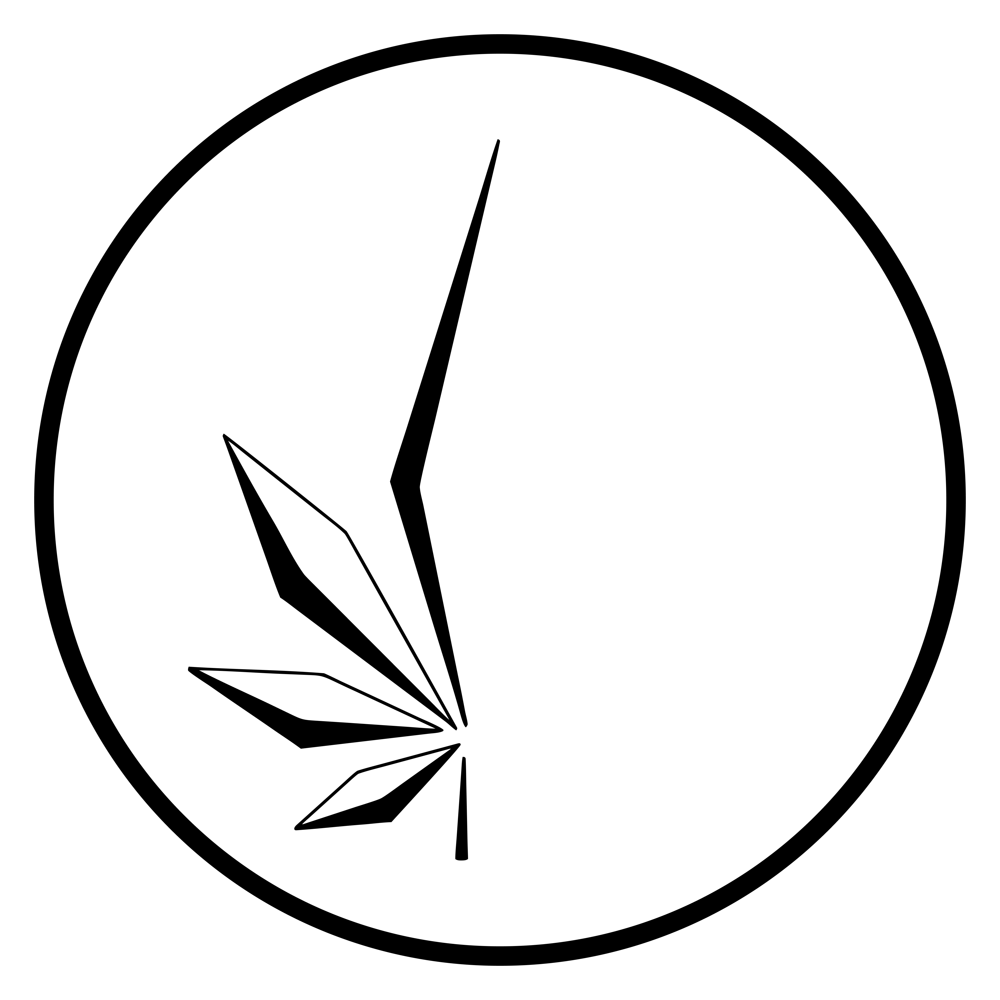
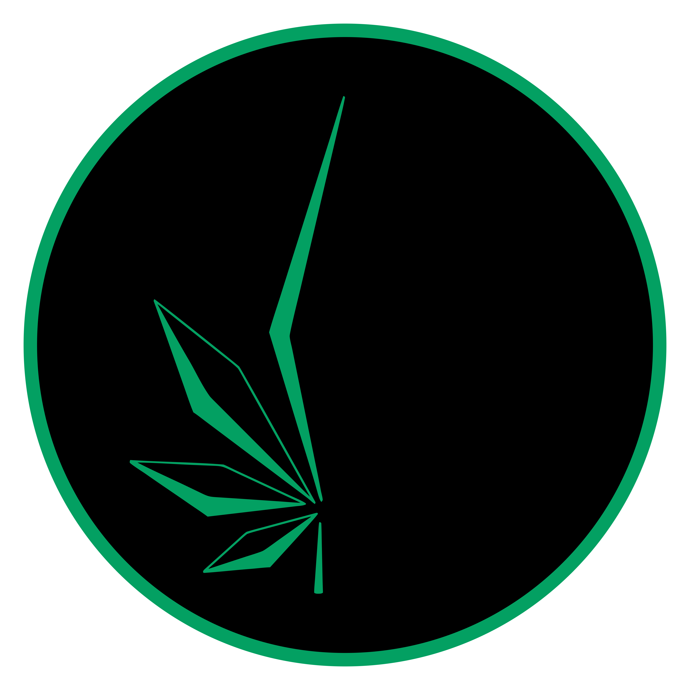
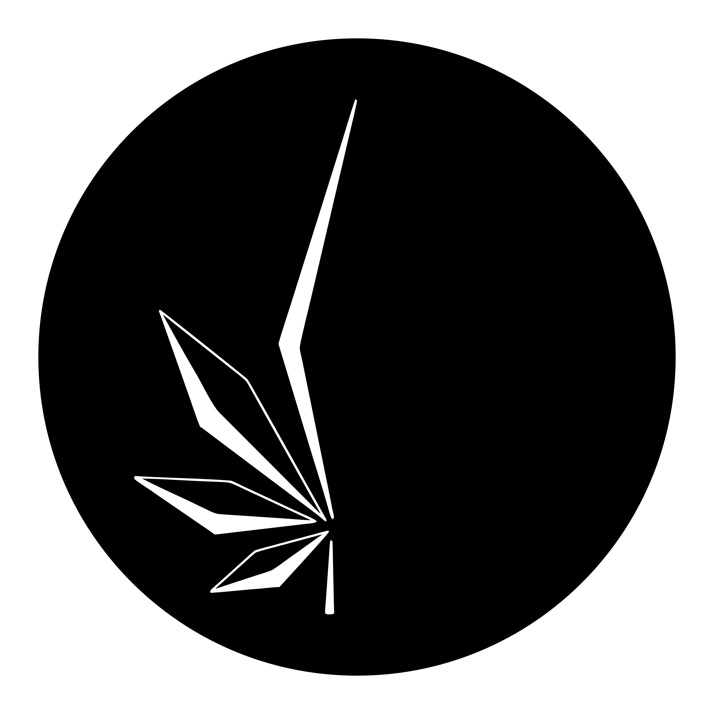
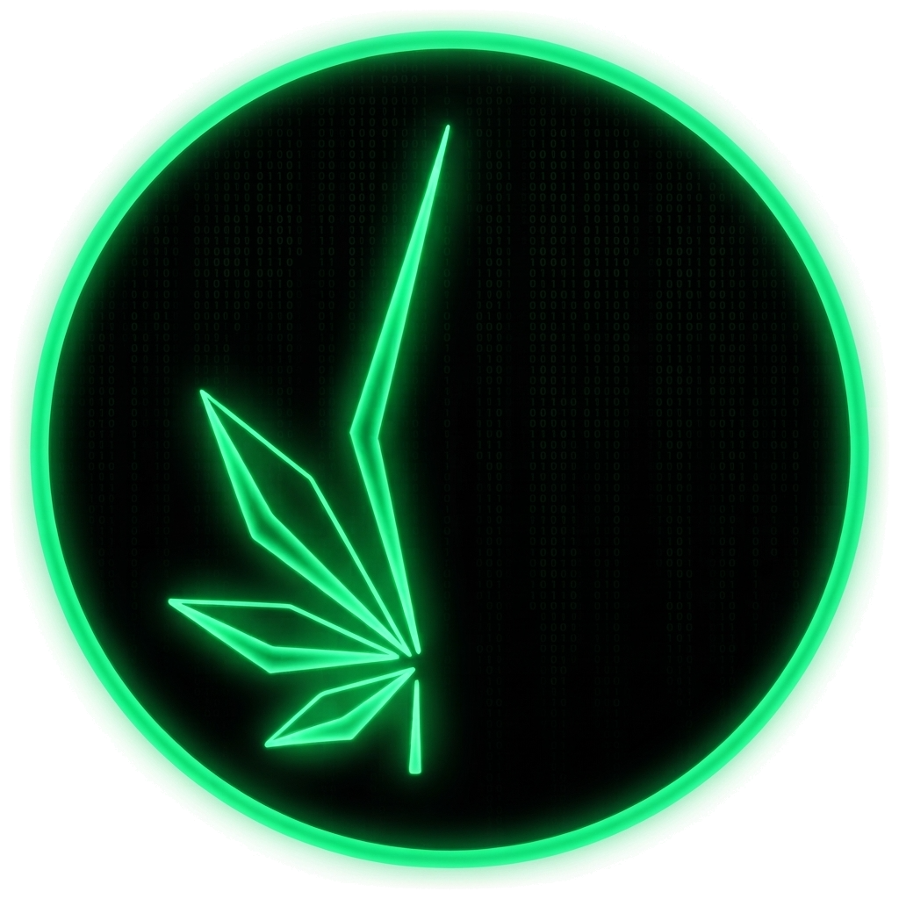
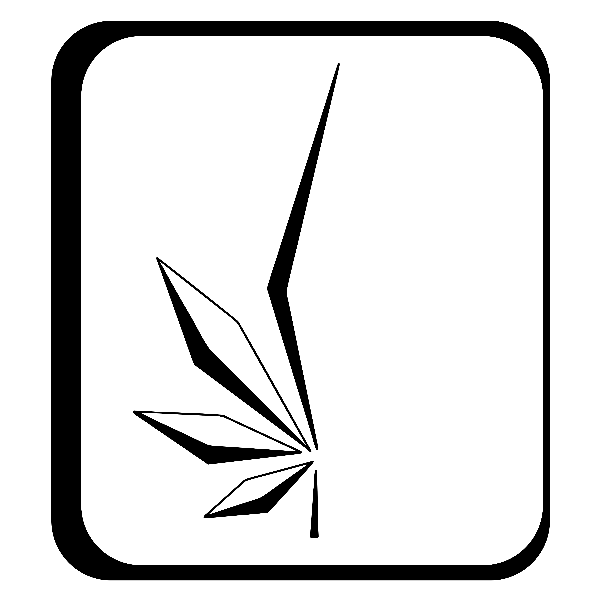
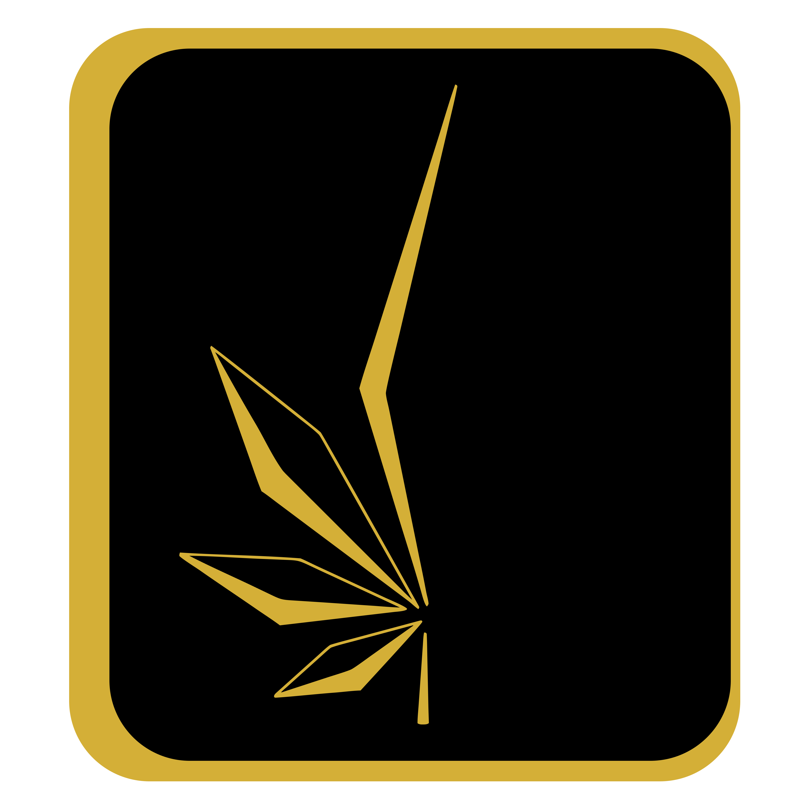
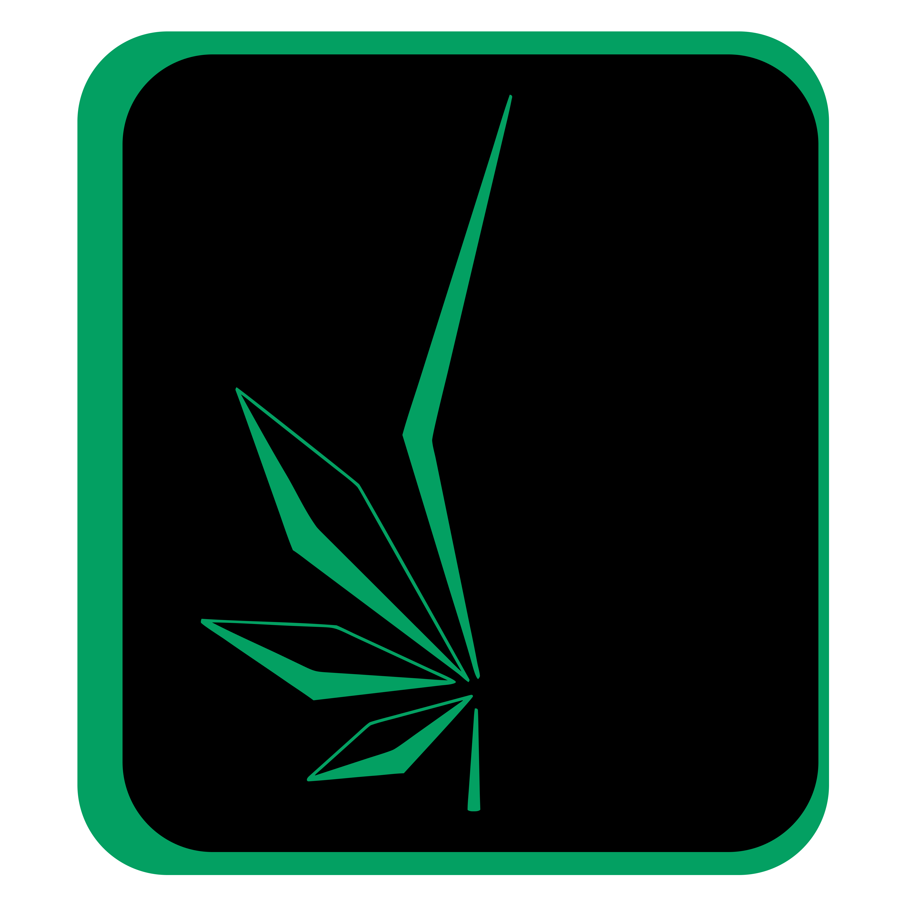
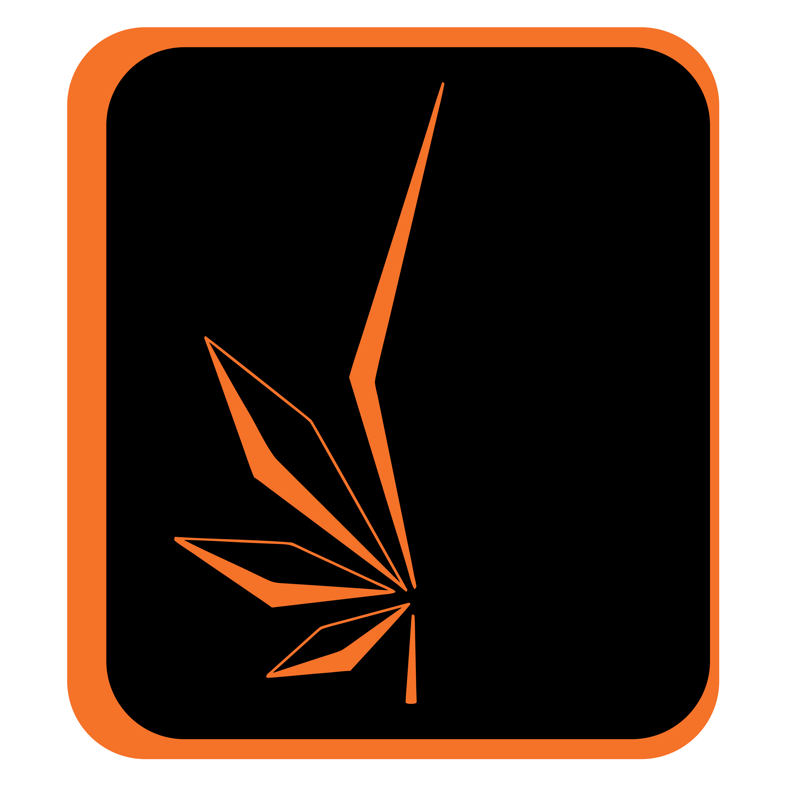
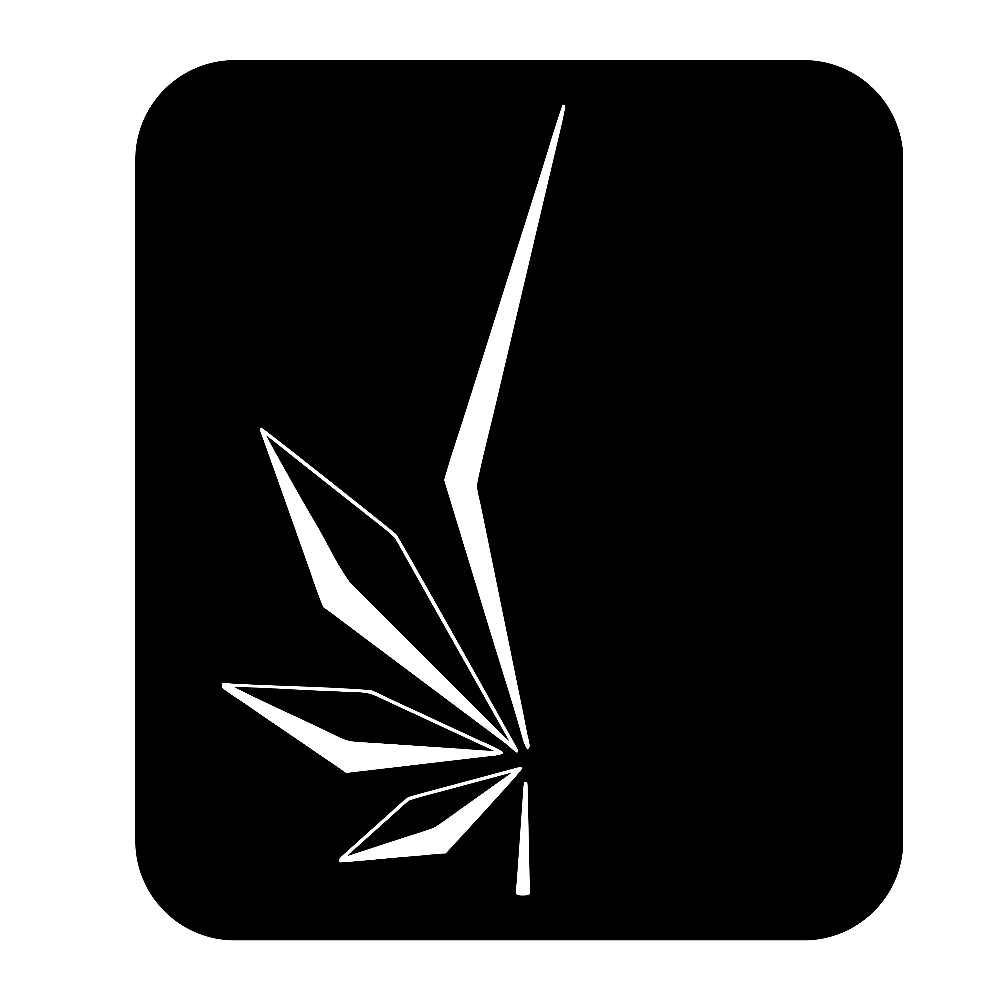
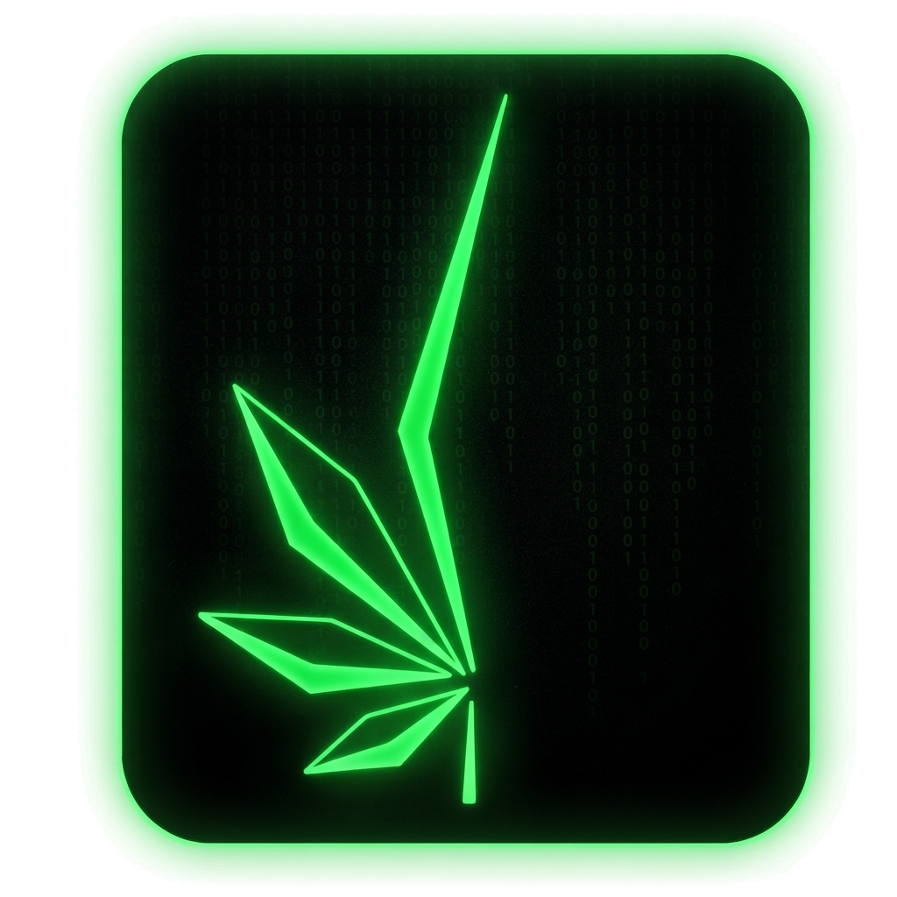

# Noviciado Brand Kit

Official brand assets for **[Noviciado](https://github.com/NovicIAdo)** — logos for web, print, social, and product use.

## Structure

```
logos/
├── ellipse/   # elliptical / badge mark (PNG + SVG)
└── square/    # square mark (PNG + SVG)
```

Each shape is available in five colors: **black**, **gold**, **green**, **orange**, **white**.  
Formats: **PNG** (raster) and **SVG** (vector, preferred for scaling).

Direct file URLs use GitHub raw content:

```
https://raw.githubusercontent.com/NovicIAdo/brand-kit/main/<path>
```

---

## Ellipse logos

| Color | Preview | PNG | SVG |
|-------|---------|-----|-----|
| Black |  | [PNG](https://raw.githubusercontent.com/NovicIAdo/brand-kit/main/logos/ellipse/black.png) | [SVG](https://raw.githubusercontent.com/NovicIAdo/brand-kit/main/logos/ellipse/black.svg) |
| Gold |  | [PNG](https://raw.githubusercontent.com/NovicIAdo/brand-kit/main/logos/ellipse/gold.png) | [SVG](https://raw.githubusercontent.com/NovicIAdo/brand-kit/main/logos/ellipse/gold.svg) |
| Green |  | [PNG](https://raw.githubusercontent.com/NovicIAdo/brand-kit/main/logos/ellipse/green.png) | [SVG](https://raw.githubusercontent.com/NovicIAdo/brand-kit/main/logos/ellipse/green.svg) |
| Orange |  | [PNG](https://raw.githubusercontent.com/NovicIAdo/brand-kit/main/logos/ellipse/orange.png) | [SVG](https://raw.githubusercontent.com/NovicIAdo/brand-kit/main/logos/ellipse/orange.svg) |
| White |  | [PNG](https://raw.githubusercontent.com/NovicIAdo/brand-kit/main/logos/ellipse/white.png) | [SVG](https://raw.githubusercontent.com/NovicIAdo/brand-kit/main/logos/ellipse/white.svg) |
| Matrix |  | [PNG](https://raw.githubusercontent.com/NovicIAdo/brand-kit/main/logos/ellipse/noviciado-matrix-circle.png) | — |

### Ellipse — direct links

| Color | PNG | SVG |
|-------|-----|-----|
| Black | https://raw.githubusercontent.com/NovicIAdo/brand-kit/main/logos/ellipse/black.png | https://raw.githubusercontent.com/NovicIAdo/brand-kit/main/logos/ellipse/black.svg |
| Gold | https://raw.githubusercontent.com/NovicIAdo/brand-kit/main/logos/ellipse/gold.png | https://raw.githubusercontent.com/NovicIAdo/brand-kit/main/logos/ellipse/gold.svg |
| Green | https://raw.githubusercontent.com/NovicIAdo/brand-kit/main/logos/ellipse/green.png | https://raw.githubusercontent.com/NovicIAdo/brand-kit/main/logos/ellipse/green.svg |
| Orange | https://raw.githubusercontent.com/NovicIAdo/brand-kit/main/logos/ellipse/orange.png | https://raw.githubusercontent.com/NovicIAdo/brand-kit/main/logos/ellipse/orange.svg |
| White | https://raw.githubusercontent.com/NovicIAdo/brand-kit/main/logos/ellipse/white.png | https://raw.githubusercontent.com/NovicIAdo/brand-kit/main/logos/ellipse/white.svg |

---

## Square logos

| Color | Preview | PNG | SVG |
|-------|---------|-----|-----|
| Black |  | [PNG](https://raw.githubusercontent.com/NovicIAdo/brand-kit/main/logos/square/black.png) | [SVG](https://raw.githubusercontent.com/NovicIAdo/brand-kit/main/logos/square/black.svg) |
| Gold |  | [PNG](https://raw.githubusercontent.com/NovicIAdo/brand-kit/main/logos/square/gold.png) | [SVG](https://raw.githubusercontent.com/NovicIAdo/brand-kit/main/logos/square/gold.svg) |
| Green |  | [PNG](https://raw.githubusercontent.com/NovicIAdo/brand-kit/main/logos/square/green.png) | [SVG](https://raw.githubusercontent.com/NovicIAdo/brand-kit/main/logos/square/green.svg) |
| Orange |  | [PNG](https://raw.githubusercontent.com/NovicIAdo/brand-kit/main/logos/square/orange.png) | [SVG](https://raw.githubusercontent.com/NovicIAdo/brand-kit/main/logos/square/orange.svg) |
| White |  | [PNG](https://raw.githubusercontent.com/NovicIAdo/brand-kit/main/logos/square/white.png) | [SVG](https://raw.githubusercontent.com/NovicIAdo/brand-kit/main/logos/square/white.svg) |
| Matrix |  | [PNG](https://raw.githubusercontent.com/NovicIAdo/brand-kit/main/logos/square/noviciado-matrix-square.png) | — |

### Square — direct links

| Color | PNG | SVG |
|-------|-----|-----|
| Black | https://raw.githubusercontent.com/NovicIAdo/brand-kit/main/logos/square/black.png | https://raw.githubusercontent.com/NovicIAdo/brand-kit/main/logos/square/black.svg |
| Gold | https://raw.githubusercontent.com/NovicIAdo/brand-kit/main/logos/square/gold.png | https://raw.githubusercontent.com/NovicIAdo/brand-kit/main/logos/square/gold.svg |
| Green | https://raw.githubusercontent.com/NovicIAdo/brand-kit/main/logos/square/green.png | https://raw.githubusercontent.com/NovicIAdo/brand-kit/main/logos/square/green.svg |
| Orange | https://raw.githubusercontent.com/NovicIAdo/brand-kit/main/logos/square/orange.png | https://raw.githubusercontent.com/NovicIAdo/brand-kit/main/logos/square/orange.svg |
| White | https://raw.githubusercontent.com/NovicIAdo/brand-kit/main/logos/square/white.png | https://raw.githubusercontent.com/NovicIAdo/brand-kit/main/logos/square/white.svg |

---

## Usage notes

- Prefer **SVG** for websites, slides, and print (scales cleanly).
- Use **PNG** when a raster asset is required (social avatars, platforms that reject SVG).
- **White** variants are intended for dark backgrounds.
- **Black** variants are intended for light backgrounds.
- **Gold / green / orange** are accent brand colors for themed materials.

## License

Brand assets © Noviciado. Use only with permission from Noviciado / NovicIAdo organization.
